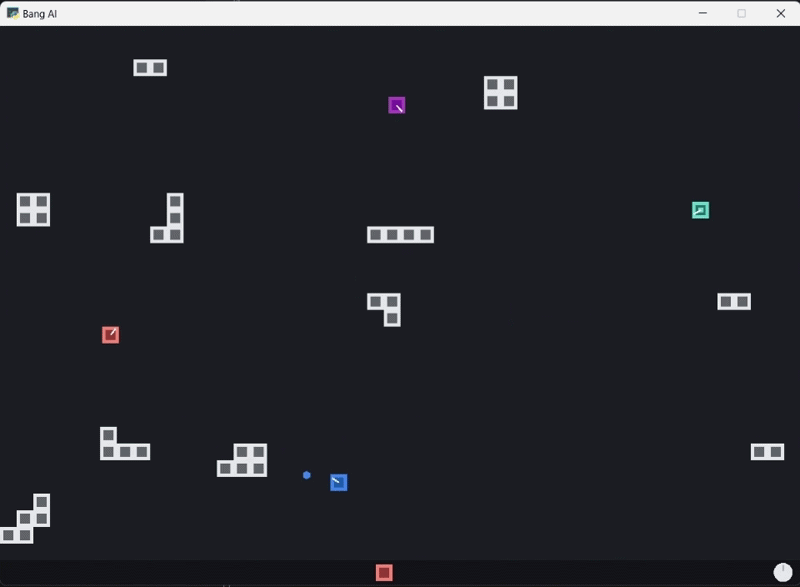

# rl-toybox

A small RL playground with shared infrastructure and arcade-style environments.

## Overview

- Shared runtime interfaces, trainers, and curriculum utilities live in `core/`.
- Game implementations live in `games/<name>/`.
- CLI entry points in `scripts/` cover training, AI play, and human play.

## Clips

<p>
  
  
  
</p>

## Run

With package install (recommended):

```bash
pip install -e .
rl-toybox-train --game bang
rl-toybox-play-ai --game bang --model best --render
rl-toybox-play-user --game bang
```

Without installation, from repo root:

```bash
python -m scripts.train --game bang
python -m scripts.play_ai --game bang --model best --render
python -m scripts.play_user --game bang
```

## Games

| Game ID | Default Algo | Obs / Action | Notes | Docs |
| --- | --- | --- | --- | --- |
| `snake` | `qlearn` | 12-dim / Discrete(3) | Classic grid snake survival game | [games/snake/README.md](games/snake/README.md) |
| `vroom` | `dqn` | 20-dim / Discrete(6) | Top-down one-lap racing on procedural tracks | [games/vroom/README.md](games/vroom/README.md) |
| `bang` | `dqn` | 24-dim / Discrete(8) | Top-down arena shooter with movement, aim, and firing | [games/bang/README.md](games/bang/README.md) |
| `walk` | `ppo` | 18-dim / Box(4) | Side-view continuous-control biped walker demo | [games/walk/README.md](games/walk/README.md) |
| `kick` | `ppo` | 48-dim / Discrete(12) | Top-down football match with MAPPO-style shared actor + centralized critic | [games/kick/README.md](games/kick/README.md) |

## Default Plans

- `snake` -> Q-learning + `LinearQNet` (`obs=12`, `act=3`, hidden `[32]`)
- `vroom` -> vanilla DQN (`obs=20`, `act=6`, hidden `[48, 48]`)
- `bang` -> enhanced DQN (`obs=24`, `act=8`, hidden `[64, 64]`)
- `walk` -> PPO continuous control (`obs=18`, `act=4`, hidden `[64, 64]`)
- `kick` -> MAPPO-style PPO (`obs=48`, `act=12`, actor `[128, 128]`, critic `[256, 256]`)
