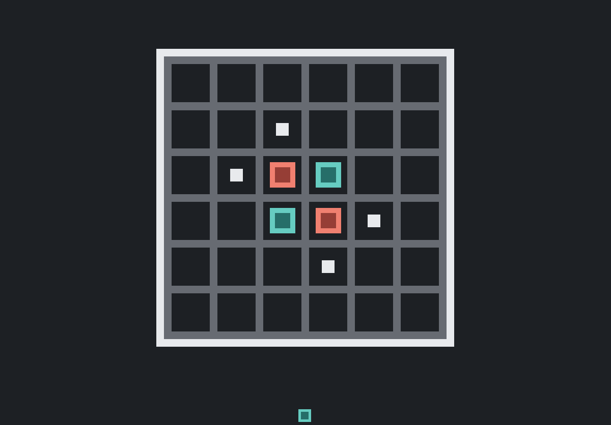

# Flip

6x6 Reversi/Othello-style board game with sparse terminal rewards, legal action masking, and the repo's compact MCTS/search-play self-play stack. It is the board self-play capstone in the active lineup.

## Clip



## Board

- Board size: `6x6`
- Artifact level slot: fixed `L1`
- Actions: one row-major placement action per cell

## Algorithm / Network

- Default algorithm: `search_play`
- IO: `obs=36`, `act=36`
- Default policy/value network: `36 -> 48 -> 48 -> (36 + 1)`
- Search: MCTS self-play with masked cell-placement actions and a small policy/value MLP

## Controls (Human)

- You play P1, the green/aqua disc.
- The opponent is P2, the red disc, driven by a local scripted policy in human mode.
- Place a disc: click a legal highlighted cell on your turn.
- Reset after a terminal game: click, `Space`, or `Enter`.

## Observation / Actions

- Observation family: board self-play `BOARD` only.
- The action mask stays outside the observation.
- Observation: `36` floats, row-major from top row to bottom row:
  - `board_r0_c0` ... `board_r0_c5`
  - `board_r1_c0` ... `board_r1_c5`
  - `board_r2_c0` ... `board_r2_c5`
  - `board_r3_c0` ... `board_r3_c5`
  - `board_r4_c0` ... `board_r4_c5`
  - `board_r5_c0` ... `board_r5_c5`
- Cell encoding is from the current-player perspective:
  - `0.0` empty
  - `1.0` current-player disc
  - `-1.0` opponent disc
- Actions: `Discrete(36)`, one row-major `place_r*_c*` action per board cell.
- Legal placements are masked in training, evaluation, and search policy scoring.
- There is no explicit pass action; when the current player has no legal placement, the environment auto-passes before policy/search selection.

## Environment Notes

- Rules follow compact Reversi/Othello:
  - two players alternate turns unless a player has no legal move
  - a move places a disc on an empty cell and flips at least one bracketed contiguous line of opponent discs
  - all 8 directions are checked
  - if neither player has a legal move, the game ends
  - the player with more discs wins; equal discs are a draw
- The board shape is fixed at `6x6` (`BOARD_ROWS=6`, `BOARD_COLS=6`).
- Game-specific rules, perspective encoding, legal masking, and square-board symmetry augmentation live under `games/flip/`.
- Shared MCTS, replay, policy/value, and self-play training pieces live under `core/search_play/`.

## Rewards (Training)

Rewards are terminal only:

- `REWARD_WIN = 10.0`
- `PENALTY_LOSS = -5.0`
- `REWARD_DRAW = 0.0`

There is no dense shaping for flipped discs, disc advantage, corners, mobility, stability, or survival. Search-play value targets use the terminal winner/draw outcome while the environment reward constants stay game-owned in `games/flip/config.py`.

## Curriculum (Train)

`flip` is fixed-mode and not staged. There is no curriculum ladder and no board-size selection; every run uses the same `6x6` board and level `L1` artifact slot.

## Run Commands

```bash
rl-toybox-train --game flip
rl-toybox-play-ai --game flip --render
rl-toybox-play-user --game flip
python -m scripts.train --game flip
python -m scripts.play_ai --game flip --render
python -m scripts.play_user --game flip
```

When `--level` is omitted, `flip` resolves to its fixed `L1` slot for training, play, evaluation, and capture.

See `games/flip/config.py`, `games/flip/spec.py`, and `games/flip/rules.py` for the fixed board shape, observation/action names, reward constants, and search-play defaults.
