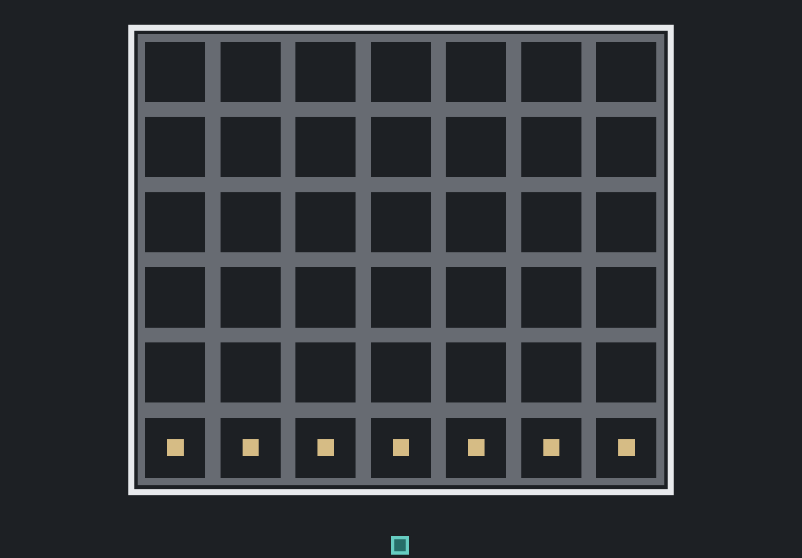

# Four

Connect Four with a fixed `7` column by `6` row board, sparse terminal rewards, legal-column masking, and the repo's compact search/self-play stack. It is the planning-oriented board-game capstone in the active lineup.

## Clip



## Algorithm / Network

- Default algorithm: `search_play`
- IO: `obs=42`, `act=7`
- Default policy/value network: `42 -> 48 -> 48 -> (7 + 1)`
- Search: MCTS self-play with masked column actions and a small policy/value MLP

## Controls (Human)

- You play P1, the green/aqua token.
- The opponent is P2, the red token, driven by the current `L1` best model.
- Drop a stone: click a non-full column on your turn
- Reset after a terminal game: click, `Space`, or `Enter`

## Observation / Actions

- Observation family: board self-play `BOARD` only
- The action mask stays outside the observation.
- Observation: `42` floats, row-major from top row to bottom row:
  - `board_r0_c0` ... `board_r0_c6`
  - `board_r1_c0` ... `board_r1_c6`
  - `board_r2_c0` ... `board_r2_c6`
  - `board_r3_c0` ... `board_r3_c6`
  - `board_r4_c0` ... `board_r4_c6`
  - `board_r5_c0` ... `board_r5_c6`
- Cell encoding is from the current player perspective:
  - `0.0` empty
  - `1.0` current player stone
  - `-1.0` opponent stone
- Actions: `Discrete(7)`
  - `0 drop_c0`
  - `1 drop_c1`
  - `2 drop_c2`
  - `3 drop_c3`
  - `4 drop_c4`
  - `5 drop_c5`
  - `6 drop_c6`

Full columns are masked in training, evaluation, and search policy scoring.

## Environment Notes

- Rules follow standard Connect Four:
  - two players alternate turns
  - stones fall to the lowest empty row in the selected column
  - four in a row wins horizontally, vertically, or diagonally
  - a full board with no winner is a draw
- The board shape is fixed at `7x6` (`BOARD_COLS=7`, `BOARD_ROWS=6`).
- Game-specific rules, perspective encoding, and symmetry augmentation live under `games/four/`.
- Shared MCTS, replay, policy/value, and self-play training pieces live under `core/search_play/`.

## Rewards (Training)

Rewards are sparse and terminal only:

- `REWARD_WIN = 10.0`
- `PENALTY_LOSS = -5.0`
- `REWARD_DRAW = 0.0`

There is no step penalty and no dense shaping. Search-play value targets use the terminal winner/draw outcome while the environment reward constants stay game-owned in `games/four/config.py`.

## Curriculum (Train)

`four` is fixed-mode and not staged. There is no curriculum ladder and no board-size selection; every run uses the same `7x6` board and level `L1` artifact slot.

## Run Commands

```bash
rl-toybox-train --game four
rl-toybox-play-ai --game four --render
rl-toybox-play-user --game four
python -m scripts.train --game four
python -m scripts.play_ai --game four --render
python -m scripts.play_user --game four
```

When `--level` is omitted, `four` resolves to its fixed `L1` slot for training, play, evaluation, and capture.

See `games/four/config.py`, `games/four/spec.py`, and `games/four/rules.py` for the fixed board shape, observation/action names, reward constants, and search-play defaults. Four's game-wide net size lives in `DEFAULT_MODEL_CONFIG["hidden_sizes"]`, its search-specific deltas live in `ALGO_CONFIG_OVERRIDES["search_play"]`, and its default self-play budget lives in `DEFAULT_TRAIN_CONFIG["budget"]`.
