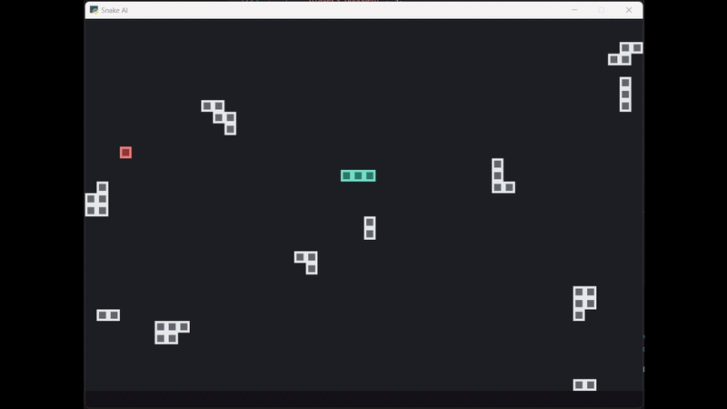

# Snake

Classic grid Snake with obstacle curriculum and lightweight shaping rewards.

## Quick Clip

[](../../media/snake-demo.mp4)

## Curriculum (Train)

- Shared 3-level curriculum progression (`core/curriculum.py`) is used in train mode.
- Promotion settings live in `games/snake/config.py` under `CURRICULUM_PROMOTION`.
- `WRAP_AROUND` is global in `games/snake/config.py`.
- Levels:
  - Level 1: `0` obstacles, timeout `160 * snake_length`
  - Level 2: `4` obstacles, timeout `130 * snake_length`
  - Level 3: `8` obstacles, timeout `100 * snake_length`

Success per episode is `1` if at least `5` foods are eaten (`SUCCESS_FOODS_REQUIRED`), else `0`.

## Controls (Human)

- Move: `W/A/S/D`

## Observation / Actions

- Observation: `12` floats (`INPUT_FEATURE_NAMES`, ordered)
  - `self_heading_sin`
  - `self_heading_cos`
  - `self_length`
  - `self_last_action`
  - `ray_fwd`
  - `ray_left`
  - `ray_right`
  - `tgt_rel_angle_sin`
  - `tgt_rel_angle_cos`
  - `tgt_manhattan_dist`
  - `tgt_dist_delta`
  - `self_steps_since_food`
- Actions: `Discrete(3)`
  - `0 straight`
  - `1 turn_right`
  - `2 turn_left`

Ray notes:
- `ray_*` are normalized distance-to-first-collision in local snake directions.
- Values are in `[0,1]`; `1.0` means no collision within ray range.

## Rewards (Training)

- Event `REWARD_FOOD`: `+10` when food is eaten.
- Outcome `PENALTY_LOSE`: `-5` on death or timeout.
- Progress shaping: `r_progress = clip(1.0 * (Phi_next - Phi_prev), -0.2, +0.2)` with `Phi = -dist_food_norm - 0.5*hunger_norm`.
- Step `PENALTY_STEP`: `-0.005` every training step.

`dist_food_norm` is normalized Manhattan head-to-food distance (shortest wrapped path when wrap-around is enabled).
`hunger_norm` is `clamp(self_steps_since_food / hunger_cap_steps, 0, 1)`.

## Run Commands

```bash
rl-toybox-train --game snake
rl-toybox-play-ai --game snake --model best --render
rl-toybox-play-user --game snake
```

Check `games/snake/config.py` for full hyperparameters and thresholds.
