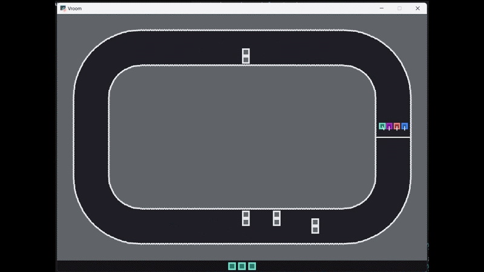

# Vroom

Top-down one-lap racing with procedural closed-loop tracks.

## Clip

[](../../media/vroom-demo.mp4)

## Algorithm / Network

- Algo: vanilla DQN
- Hidden sizes: `[48, 48]`

## Controls (Human)

- Steer: `A/D` or left/right arrows
- Throttle: `W` or up arrow
- Coast: no input

## Observation / Actions

- Observation: `20` floats (`INPUT_FEATURE_NAMES`, ordered)
  - `self_lat_offset`
  - `self_lat_offset_delta`
  - `self_fwd_speed`
  - `self_fwd_speed_delta`
  - `self_heading_sin`
  - `self_heading_cos`
  - `self_in_contact`
  - `self_last_action`
  - `ray_fwd_near`
  - `ray_fwd_far`
  - `ray_fwd_left`
  - `ray_fwd_right`
  - `tgt_dx`
  - `tgt_dy`
  - `tgt_dvx`
  - `tgt_dvy`
  - `trk_lookahead_sin`
  - `trk_lookahead_cos`
  - `trk_lookahead_dist`
  - `trk_curvature_ahead`
- Actions: `Discrete(6)` (`ACTION_NAMES`, ordered)
  - `0 coast`
  - `1 throttle`
  - `2 left_coast`
  - `3 right_coast`
  - `4 left_throttle`
  - `5 right_throttle`

Ray notes:
- `ray_*` are normalized distance-to-first-hit values in `[0,1]`.
- `1.0` means no hit within ray range.
- Hits include walls and obstacles.

## Race Rules

- Each race is exactly `1` lap.
- A new random smooth closed-loop track is created at every reset.
- If any car completes a lap, the race ends.
- Race count per episode:
  - `train` / `eval`: `1` race
  - `human` (`rl-toybox-play-user`): `10` races per set

## Rewards (Training)

- Outcome `REWARD_WIN`: `+10` when the player wins.
- Outcome `PENALTY_LOSE`: `-5` when another car wins or timeout resolves against player.
- Progress shaping: `r_progress = clip(1.0 * (Phi_next - Phi_prev), -0.2, +0.2)` with `Phi = track_progress_norm`.
- Event `PENALTY_COLLISION`: `-1.0` on collision-start events.
- Step `PENALTY_STEP`: `-0.01` every training step.

## Curriculum (Train)

- Shared 3-level curriculum progression (`core/curriculum.py`) is used in train mode.
- Promotion settings live in `games/vroom/config.py` under `CURRICULUM_PROMOTION`.
- Levels:
  - Level 1: `1` car (player only), no obstacles
  - Level 2: `2` cars, opponent speed cap `0.75x`, no obstacles
  - Level 3: `4` cars, full opponent speed, obstacle clusters enabled

Success per episode is `1` if player wins, else `0`.

## Run Commands

```bash
rl-toybox-train --game vroom
rl-toybox-play-ai --game vroom --model best --render
rl-toybox-play-user --game vroom
```

Check `games/vroom/config.py` for full hyperparameters.
